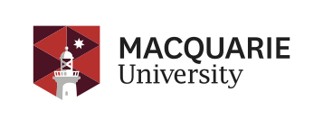
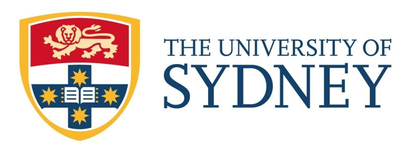

***Registration Form Coming Soon***

**Date:** 	Wednesday, February 08 2023

**Venue:** 2100 Learning studio, Abercrombie Business School, The University of Sydney

*A one-day symposium (in-person and via Zoom) on the cultural translation, transference, and adoption of developing technologies in robotics and artificial intelligence*

This symposium aims to explore the existing and possible future impacts of robotic and AI technologies. It draws its inspiration from Amara's Law, an aphorism stated by the late Roy Amara (the Institute for the Future): ‘We tend to overestimate the effect of a technology in the short run and underestimate the effect in the long run’ (Amara, 2006). To this end, the symposium aims to highlight the cultural interpretation and/or transference of technologies between cultures. Andrew Feenberg, a leading philosopher of technology, discusses the complex entanglements of technology, society, and culture in a globalised world. He uses the terms ‘branching’ and ‘layering’ to explain these relations (2010). In the branching of a technology, ‘the trace of [Western or dominant] values appears clearly in design features of technical artifacts’ in the new culture, though that particular technology might be layered on top of or beneath specific cultural values and codes (Feenberg 2010). 

This event seeks to investigate, through discussion of case studies, where cultural values have influenced or are currently influencing the adoption or rejection of robotic and AI technologies, and how societies adapt to ‘new’ and ‘imported’ technologies. While a discussion of transference or adoption relates to both a ‘source’ culture and a ‘destination’ cultural context, practices that decentre practices that have been deemed central, or articulate how the ‘periphery’ has shaped or influenced the ‘centre’, will be examined. 

**Keynote Speakers:**

- Professor Kaoru Endo (Gakushuin University, Japan)
- Associate Professor Christoph Bartneck (University of Canterbury, New Zealand)

**The Committee Members:**

Yuji Sone (Organiser), Richard Savery, and Chris Muller (Macquarie University)
Ben Nickl, Justine Humphry, and Chris Chesher (University of Sydney)

**Supported by:**

Toshiba International Foundation (TIFO); Department of Media, Communications, Creative Arts, Language and Literature, Macquarie University; and Department of Media and Communications, University of Sydney

||||
<!-- 

 -->

This symposium is associated with the 29th Annual Conference of the Australasian Humour Studies Network. 

Contact: yuji.sone[at]mq.edu.au
